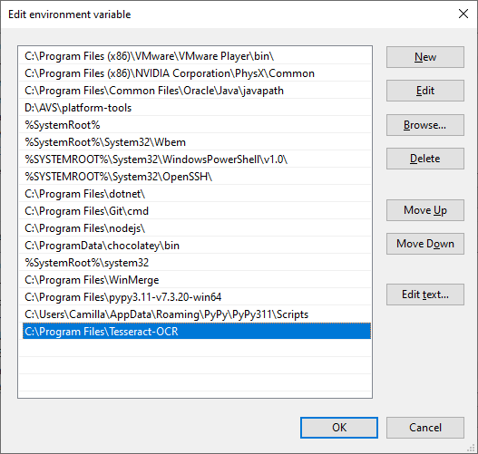
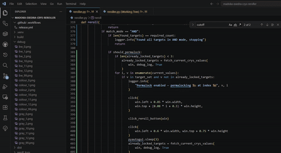

# Crys Reroller for Exedra

## Requires

* [Tesseract OCR](https://github.com/UB-Mannheim/tesseract/wiki) installed and [added to PATH](https://gist.github.com/ScribbleGhost/752ec213b57eef5f232053e04f9d0d54). Then restart your computer
* Download the exe file of this tool from [releases](https://github.com/thefrozenfishy/exedra-crys-reroller/releases)

## Usage

* This assumes your game runs in 16:9 aspect ratio. I have not tested on emulator myself so do tell if it doesn't work.
* Download exe from [releases](https://github.com/thefrozenfishy/exedra-link-raid-automation/releases) and run. Keep in mind the window needs to be visible on the screen for the OCR to function properly.
* At any point, press ``ctrl+shift+q`` to exit the program.
* At any point, press ``ctrl+shift+e`` to stop rolling.
* Check all the stats you wish to reroll for. It will consider any stat equal to or better than the ``Minimum value`` as a target. So if you want any crit rate just choose Minimum value ``Increase critical rate by 0.5%``.
* There's two modes:
  * In OR mode it will stop if any of the targets are present.
  * In AND mode it will stop once all targets are present.
    * If you check the ``Permalock options underways`` box it will permalock any reached target and then continue until all targets are rolled. Ideally do this with targets ``Increases critical rate by 5%`` and ``Increases critical DMG by 10%`` on attackers, or similar hard to obtain rolls.
* Save roll logs stores your rolls in the ``reroll_logs`` folder, do with these as you please, but also if you obtain a lot TFF would love to get them to analyze roll probabilities.
* Note the program assumes you have default keybinding where reroll is on the ``Enter`` key.
